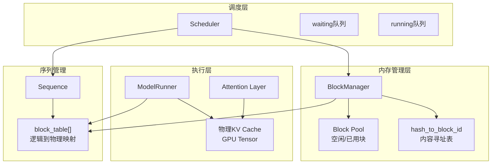

# BlockManager 在 nano-vllm 中的核心功能和作用机制

## 一、核心功能概述

**BlockManager** 是 nano-vllm 中的核心内存管理组件，负责实现**分页式 KV 缓存系统**，支持前缀缓存和引用计数共享机制。 [1](#4-0) 

BlockManager 管理两个核心数据结构：
- **Block 对象列表**：每个 Block 包含物理块 ID、引用计数、哈希值和 token_ids
- **哈希到块 ID 的映射**：实现基于内容的块查找和共享 [2](#4-1) 

## 二、KV 缓存块管理机制

### 2.1 块的分配（Prefill 阶段）

`allocate()` 方法在 prefill 阶段为整个序列分配所需的所有块： [3](#4-2) 

分配流程：
1. 遍历序列需要的每个块
2. 计算块的哈希值（使用 xxhash，结合前缀块的哈希） [4](#4-3) 
3. 检查哈希表中是否已存在相同内容的块（前缀缓存命中）
4. 如果缓存未命中，从空闲块池分配新块；如果缓存命中，增加引用计数
5. 将块 ID 添加到序列的 `block_table` 中

### 2.2 块的扩展（Decode 阶段）

`may_append()` 方法在 decode 阶段为序列追加新的 token： [5](#4-4) 

扩展逻辑：
- 当最后一个块填满第一个 token 时（`len(seq) % block_size == 1`），分配新块
- 当最后一个块填满时（`len(seq) % block_size == 0`），更新块的哈希值并注册到哈希表

### 2.3 块的释放

`deallocate()` 方法释放序列占用的所有块： [6](#4-5) 

采用反向遍历方式释放块，确保引用计数正确递减。只有引用计数降为 0 的块才会真正释放到空闲池。 [7](#4-6) 

## 三、前缀缓存实现

### 3.1 基于内容的哈希机制

前缀缓存通过 **xxhash** 算法实现内容寻址： [4](#4-3) 

关键特性：
- 使用链式哈希：当前块的哈希值包含前一个块的哈希值作为前缀
- 只对完整块（填满 `block_size` 个 token）计算哈希
- 通过 `hash_to_block_id` 字典实现 O(1) 查找

### 3.2 块共享与引用计数

当检测到相同内容的块时：
- 如果该块已在使用中（`in used_block_ids`），直接增加引用计数
- 如果该块在空闲池中，重新分配并初始化引用计数
- 记录 `num_cached_tokens` 用于跳过已缓存的 token [8](#4-7) 

## 四、引用计数管理

### 4.1 引用计数生命周期

每个 Block 对象维护 `ref_count` 字段： [9](#4-8) 

引用计数变化时机：
- **分配时**：`reset()` 将 `ref_count` 设为 1 [10](#4-9) 
- **共享时**：相同内容的块增加引用计数 [11](#4-10) 
- **释放时**：递减引用计数，降为 0 时回收块 [12](#4-11) 

### 4.2 Copy-on-Write 机制

只读块可以被多个序列共享。在 decode 阶段，最后一个未填满的块不计算哈希（`hash == -1`），防止不完整内容被错误共享。 [13](#4-12) 

## 五、与 Scheduler 的集成

### 5.1 初始化和资源检查

Scheduler 在初始化时创建 BlockManager 实例： [14](#4-13) 

### 5.2 调度时的资源协调

在 `schedule()` 方法中，Scheduler 通过 BlockManager 接口检查和分配资源：

**Prefill 阶段**： [15](#4-14) 

- 使用 `can_allocate()` 检查是否有足够空闲块 [16](#4-15) 
- 调用 `allocate()` 分配所有需要的块

**Decode 阶段**： [17](#4-16) 

- 使用 `can_append()` 检查是否需要新块 [18](#4-17) 
- 调用 `may_append()` 扩展块表

### 5.3 抢占机制

资源不足时，Scheduler 调用 `preempt()` 释放块： [19](#4-18) 

完成时也会释放： [20](#4-19) 

## 六、与 ModelRunner 的集成

### 6.1 物理 KV Cache 分配

ModelRunner 在初始化时分配物理 KV cache 张量，其容量由 BlockManager 管理的块数决定： [21](#4-20) 

物理 KV cache 的形状为 `[2, num_layers, num_blocks, block_size, num_kv_heads, head_dim]`，每个 attention 层获得对应层的视图。

### 6.2 Block Tables 的准备

ModelRunner 将序列的 `block_table` 列表转换为 GPU 张量： [22](#4-21) 

### 6.3 Prefill 阶段的数据准备 [23](#4-22) 

关键步骤：
1. 构建 `slot_mapping`：将每个 token 映射到物理 KV cache 的位置
2. 跳过已缓存的 token（`seq.num_cached_tokens`）
3. 当存在前缀缓存时（`cu_seqlens_k > cu_seqlens_q`），传递 `block_tables` 给 attention 层

### 6.4 Decode 阶段的数据准备 [24](#4-23) 

为每个序列计算最后一个 token 的 `slot_mapping` 位置，并准备 `block_tables` 用于 paged attention。

### 6.5 Attention 层的使用

Attention 层通过 Context 获取这些信息，并使用 Triton 内核将 KV 存储到正确位置： [25](#4-24) 

Triton 内核实现： [26](#4-25) 

## 七、工作流程总结



## Notes

BlockManager 通过以下创新设计实现高效内存管理：

1. **分页架构**：将 KV cache 分割成固定大小的块（默认 256 tokens），支持不连续内存分配
2. **前缀缓存**：通过链式哈希实现自动的前缀共享，显著减少重复计算
3. **引用计数**：允许多个序列安全共享只读块，提高内存利用率
4. **延迟哈希计算**：只对完整块计算哈希，避免不完整块的错误共享

这些机制共同支撑了 nano-vllm 的高吞吐量和低延迟推理能力，特别是在处理具有相似前缀的批量请求时表现突出。

### Citations

**File:** nanovllm/engine/block_manager.py (L8-23)
```python
class Block:

    def __init__(self, block_id):
        self.block_id = block_id
        self.ref_count = 0
        self.hash = -1
        self.token_ids = []

    def update(self, hash: int, token_ids: list[int]):
        self.hash = hash
        self.token_ids = token_ids

    def reset(self):
        self.ref_count = 1
        self.hash = -1
        self.token_ids = []
```

**File:** nanovllm/engine/block_manager.py (L26-33)
```python
class BlockManager:

    def __init__(self, num_blocks: int, block_size: int):
        self.block_size = block_size
        self.blocks: list[Block] = [Block(i) for i in range(num_blocks)]
        self.hash_to_block_id: dict[int, int] = dict()
        self.free_block_ids: deque[int] = deque(range(num_blocks))
        self.used_block_ids: set[int] = set()
```

**File:** nanovllm/engine/block_manager.py (L35-41)
```python
    @classmethod
    def compute_hash(cls, token_ids: list[int], prefix: int = -1):
        h = xxhash.xxh64()
        if prefix != -1:
            h.update(prefix.to_bytes(8, "little"))
        h.update(np.array(token_ids).tobytes())
        return h.intdigest()
```

**File:** nanovllm/engine/block_manager.py (L51-54)
```python
    def _deallocate_block(self, block_id: int) -> Block:
        assert self.blocks[block_id].ref_count == 0
        self.used_block_ids.remove(block_id)
        self.free_block_ids.append(block_id)
```

**File:** nanovllm/engine/block_manager.py (L56-57)
```python
    def can_allocate(self, seq: Sequence) -> bool:
        return len(self.free_block_ids) >= seq.num_blocks
```

**File:** nanovllm/engine/block_manager.py (L59-82)
```python
    def allocate(self, seq: Sequence):
        assert not seq.block_table
        h = -1
        cache_miss = False
        for i in range(seq.num_blocks):
            token_ids = seq.block(i)
            h = self.compute_hash(token_ids, h) if len(token_ids) == self.block_size else -1
            block_id = self.hash_to_block_id.get(h, -1)
            if block_id == -1 or self.blocks[block_id].token_ids != token_ids:
                cache_miss = True
            if cache_miss:
                block_id = self.free_block_ids[0]
                block = self._allocate_block(block_id)
            else:
                seq.num_cached_tokens += self.block_size
                if block_id in self.used_block_ids:
                    block = self.blocks[block_id]
                    block.ref_count += 1
                else:
                    block = self._allocate_block(block_id)
            if h != -1:
                block.update(h, token_ids)
                self.hash_to_block_id[h] = block_id
            seq.block_table.append(block_id)
```

**File:** nanovllm/engine/block_manager.py (L84-91)
```python
    def deallocate(self, seq: Sequence):
        for block_id in reversed(seq.block_table):
            block = self.blocks[block_id]
            block.ref_count -= 1
            if block.ref_count == 0:
                self._deallocate_block(block_id)
        seq.num_cached_tokens = 0
        seq.block_table.clear()
```

**File:** nanovllm/engine/block_manager.py (L93-94)
```python
    def can_append(self, seq: Sequence) -> bool:
        return len(self.free_block_ids) >= (len(seq) % self.block_size == 1)
```

**File:** nanovllm/engine/block_manager.py (L96-112)
```python
    def may_append(self, seq: Sequence):
        block_table = seq.block_table
        last_block = self.blocks[block_table[-1]]
        if len(seq) % self.block_size == 1:
            assert last_block.hash != -1
            block_id = self.free_block_ids[0]
            self._allocate_block(block_id)
            block_table.append(block_id)
        elif len(seq) % self.block_size == 0:
            assert last_block.hash == -1
            token_ids = seq.block(seq.num_blocks-1)
            prefix = self.blocks[block_table[-2]].hash if len(block_table) > 1 else -1
            h = self.compute_hash(token_ids, prefix)
            last_block.update(h, token_ids)
            self.hash_to_block_id[h] = last_block.block_id
        else:
            assert last_block.hash == -1
```

**File:** nanovllm/engine/scheduler.py (L10-16)
```python
    def __init__(self, config: Config):
        self.max_num_seqs = config.max_num_seqs
        self.max_num_batched_tokens = config.max_num_batched_tokens
        self.eos = config.eos
        self.block_manager = BlockManager(config.num_kvcache_blocks, config.kvcache_block_size)
        self.waiting: deque[Sequence] = deque()
        self.running: deque[Sequence] = deque()
```

**File:** nanovllm/engine/scheduler.py (L29-39)
```python
        while self.waiting and num_seqs < self.max_num_seqs:
            seq = self.waiting[0]
            if num_batched_tokens + len(seq) > self.max_num_batched_tokens or not self.block_manager.can_allocate(seq):
                break
            num_seqs += 1
            self.block_manager.allocate(seq)
            num_batched_tokens += len(seq) - seq.num_cached_tokens
            seq.status = SequenceStatus.RUNNING
            self.waiting.popleft()
            self.running.append(seq)
            scheduled_seqs.append(seq)
```

**File:** nanovllm/engine/scheduler.py (L44-57)
```python
        while self.running and num_seqs < self.max_num_seqs:
            seq = self.running.popleft()
            while not self.block_manager.can_append(seq):
                if self.running:
                    self.preempt(self.running.pop())
                else:
                    self.preempt(seq)
                    break
            else:
                num_seqs += 1
                self.block_manager.may_append(seq)
                scheduled_seqs.append(seq)
        assert scheduled_seqs
        self.running.extendleft(reversed(scheduled_seqs))
```

**File:** nanovllm/engine/scheduler.py (L60-63)
```python
    def preempt(self, seq: Sequence):
        seq.status = SequenceStatus.WAITING
        self.block_manager.deallocate(seq)
        self.waiting.appendleft(seq)
```

**File:** nanovllm/engine/scheduler.py (L68-70)
```python
            if (not seq.ignore_eos and token_id == self.eos) or seq.num_completion_tokens == seq.max_tokens:
                seq.status = SequenceStatus.FINISHED
                self.block_manager.deallocate(seq)
```

**File:** nanovllm/engine/model_runner.py (L100-118)
```python
    def allocate_kv_cache(self):
        config = self.config
        hf_config = config.hf_config
        free, total = torch.cuda.mem_get_info()
        used = total - free
        peak = torch.cuda.memory_stats()["allocated_bytes.all.peak"]
        current = torch.cuda.memory_stats()["allocated_bytes.all.current"]
        num_kv_heads = hf_config.num_key_value_heads // self.world_size
        head_dim = getattr(hf_config, "head_dim", hf_config.hidden_size // hf_config.num_attention_heads)
        block_bytes = 2 * hf_config.num_hidden_layers * self.block_size * num_kv_heads * head_dim * hf_config.torch_dtype.itemsize
        config.num_kvcache_blocks = int(total * config.gpu_memory_utilization - used - peak + current) // block_bytes
        assert config.num_kvcache_blocks > 0
        self.kv_cache = torch.empty(2, hf_config.num_hidden_layers, config.num_kvcache_blocks, self.block_size, num_kv_heads, head_dim)
        layer_id = 0
        for module in self.model.modules():
            if hasattr(module, "k_cache") and hasattr(module, "v_cache"):
                module.k_cache = self.kv_cache[0, layer_id]
                module.v_cache = self.kv_cache[1, layer_id]
                layer_id += 1
```

**File:** nanovllm/engine/model_runner.py (L120-124)
```python
    def prepare_block_tables(self, seqs: list[Sequence]):
        max_len = max(len(seq.block_table) for seq in seqs)
        block_tables = [seq.block_table + [-1] * (max_len - len(seq.block_table)) for seq in seqs]
        block_tables = torch.tensor(block_tables, dtype=torch.int32, pin_memory=True).cuda(non_blocking=True)
        return block_tables
```

**File:** nanovllm/engine/model_runner.py (L126-162)
```python
    def prepare_prefill(self, seqs: list[Sequence]):
        input_ids = []
        positions = []
        cu_seqlens_q = [0]
        cu_seqlens_k = [0]
        max_seqlen_q = 0
        max_seqlen_k = 0
        slot_mapping = []
        block_tables = None
        for seq in seqs:
            seqlen = len(seq)
            input_ids.extend(seq[seq.num_cached_tokens:])
            positions.extend(list(range(seq.num_cached_tokens, seqlen)))
            seqlen_q = seqlen - seq.num_cached_tokens
            seqlen_k = seqlen
            cu_seqlens_q.append(cu_seqlens_q[-1] + seqlen_q)
            cu_seqlens_k.append(cu_seqlens_k[-1] + seqlen_k)
            max_seqlen_q = max(seqlen_q, max_seqlen_q)
            max_seqlen_k = max(seqlen_k, max_seqlen_k)
            if not seq.block_table:    # warmup
                continue
            for i in range(seq.num_cached_blocks, seq.num_blocks):
                start = seq.block_table[i] * self.block_size
                if i != seq.num_blocks - 1:
                    end = start + self.block_size
                else:
                    end = start + seq.last_block_num_tokens 
                slot_mapping.extend(list(range(start, end)))
        if cu_seqlens_k[-1] > cu_seqlens_q[-1]:    # prefix cache
            block_tables = self.prepare_block_tables(seqs)
        input_ids = torch.tensor(input_ids, dtype=torch.int64, pin_memory=True).cuda(non_blocking=True)
        positions = torch.tensor(positions, dtype=torch.int64, pin_memory=True).cuda(non_blocking=True)
        cu_seqlens_q = torch.tensor(cu_seqlens_q, dtype=torch.int32, pin_memory=True).cuda(non_blocking=True)
        cu_seqlens_k = torch.tensor(cu_seqlens_k, dtype=torch.int32, pin_memory=True).cuda(non_blocking=True)
        slot_mapping = torch.tensor(slot_mapping, dtype=torch.int32, pin_memory=True).cuda(non_blocking=True)
        set_context(True, cu_seqlens_q, cu_seqlens_k, max_seqlen_q, max_seqlen_k, slot_mapping, None, block_tables)
        return input_ids, positions
```

**File:** nanovllm/engine/model_runner.py (L164-180)
```python
    def prepare_decode(self, seqs: list[Sequence]):
        input_ids = []
        positions = []
        slot_mapping = []
        context_lens = []
        for seq in seqs:
            input_ids.append(seq.last_token)
            positions.append(len(seq) - 1)
            context_lens.append(len(seq))
            slot_mapping.append(seq.block_table[-1] * self.block_size + seq.last_block_num_tokens  - 1)
        input_ids = torch.tensor(input_ids, dtype=torch.int64, pin_memory=True).cuda(non_blocking=True)
        positions = torch.tensor(positions, dtype=torch.int64, pin_memory=True).cuda(non_blocking=True)
        slot_mapping = torch.tensor(slot_mapping, dtype=torch.int32, pin_memory=True).cuda(non_blocking=True)
        context_lens = torch.tensor(context_lens, dtype=torch.int32, pin_memory=True).cuda(non_blocking=True)
        block_tables = self.prepare_block_tables(seqs)
        set_context(False, slot_mapping=slot_mapping, context_lens=context_lens, block_tables=block_tables)
        return input_ids, positions
```

**File:** nanovllm/layers/attention.py (L10-30)
```python
@triton.jit
def store_kvcache_kernel(
    key_ptr,
    key_stride,
    value_ptr,
    value_stride,
    k_cache_ptr,
    v_cache_ptr,
    slot_mapping_ptr,
    D: tl.constexpr,
):
    idx = tl.program_id(0)
    slot = tl.load(slot_mapping_ptr + idx)
    if slot == -1: return
    key_offsets = idx * key_stride + tl.arange(0, D)
    value_offsets = idx * value_stride + tl.arange(0, D)
    key = tl.load(key_ptr + key_offsets)
    value = tl.load(value_ptr + value_offsets)
    cache_offsets = slot * D + tl.arange(0, D)
    tl.store(k_cache_ptr + cache_offsets, key)
    tl.store(v_cache_ptr + cache_offsets, value)
```

**File:** nanovllm/layers/attention.py (L59-75)
```python
    def forward(self, q: torch.Tensor, k: torch.Tensor, v: torch.Tensor):
        context = get_context()
        k_cache, v_cache = self.k_cache, self.v_cache
        if k_cache.numel() and v_cache.numel():
            store_kvcache(k, v, k_cache, v_cache, context.slot_mapping)
        if context.is_prefill:
            if context.block_tables is not None:    # prefix cache
                k, v = k_cache, v_cache
            o = flash_attn_varlen_func(q, k, v,
                                       max_seqlen_q=context.max_seqlen_q, cu_seqlens_q=context.cu_seqlens_q,
                                       max_seqlen_k=context.max_seqlen_k, cu_seqlens_k=context.cu_seqlens_k,
                                       softmax_scale=self.scale, causal=True, block_table=context.block_tables)
        else:    # decode
            o = flash_attn_with_kvcache(q.unsqueeze(1), k_cache, v_cache,
                                        cache_seqlens=context.context_lens, block_table=context.block_tables, 
                                        softmax_scale=self.scale, causal=True)
        return o
```
