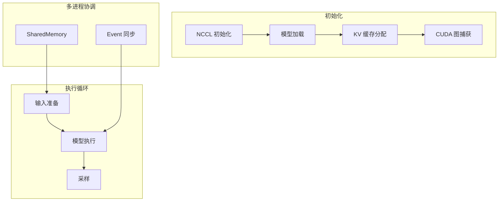

ModelRunner 是 nano-vllm 中的分布式模型执行引擎，负责模型加载、KV 缓存管理、输入数据准备和模型前向传播执行，支持多 GPU 张量并行和 CUDA 图优化 [1](#5-0) 。

## 核心职责

### 分布式执行协调
- 初始化 NCCL 进程组用于多 GPU 通信 [2](#5-1) 
- 支持主进程-工作进程架构，通过 SharedMemory 传递方法调用 [3](#5-2) 

### 内存管理
- 根据可用 GPU 内存计算并分配 KV 缓存张量 [4](#5-3) 
- 为每个 Attention 层分配 K/V 缓存视图 [5](#5-4) 

### 输入数据准备
- **Prefill 阶段**：构建 input_ids、positions、cu_seqlens、slot_mapping，支持前缀缓存 [6](#5-5) 
- **Decode 阶段**：准备最后一个 token 的输入和位置信息 [7](#5-6) 

### 模型执行优化
- 支持 eager 执行和 CUDA 图两种模式 [8](#5-7) 
- 为不同批次大小预捕获 CUDA 图以减少 kernel 启动开销 [9](#5-8) 

## 执行流程



## 与其他组件协作

- **与 LLMEngine**：通过 `call()` 方法接收执行指令 [10](#5-9) 
- **与 Scheduler**：接收调度后的序列列表执行推理 [11](#5-10) 
- **与 Attention 层**：通过 Context 传递 block_tables 和 slot_mapping [12](#5-11) 

## Notes

ModelRunner 通过精心设计的执行流程实现了高吞吐量推理：
1. **分布式支持**：完整的张量并行实现，支持多 GPU 扩展
2. **内存优化**：精确的 KV 缓存管理，最大化 GPU 内存利用率
3. **计算优化**：CUDA 图减少 kernel 启动开销，特别适合 decode 阶段
4. **灵活执行**：根据批次大小和阶段自动选择最优执行模式

这些设计使 ModelRunner 成为 nano-vllm 高性能推理的核心执行引擎。

Wiki pages you might want to explore:
- [Architecture Overview (GeeeekExplorer/nano-vllm)](/wiki/GeeeekExplorer/nano-vllm#1.2)
- [Scheduler - Request Management (GeeeekExplorer/nano-vllm)](/wiki/GeeeekExplorer/nano-vllm#2.3)

### Citations

**File:** nanovllm/engine/model_runner.py (L15-40)
```python
class ModelRunner:

    def __init__(self, config: Config, rank: int, event: Event | list[Event]):
        self.config = config
        hf_config = config.hf_config
        self.block_size = config.kvcache_block_size
        self.enforce_eager = config.enforce_eager
        self.world_size = config.tensor_parallel_size
        self.rank = rank
        self.event = event

        dist.init_process_group("nccl", "tcp://localhost:2333", world_size=self.world_size, rank=rank)
        torch.cuda.set_device(rank)
        default_dtype = torch.get_default_dtype()
        torch.set_default_dtype(hf_config.torch_dtype)
        torch.set_default_device("cuda")
        self.model = Qwen3ForCausalLM(hf_config)
        load_model(self.model, config.model)
        self.sampler = Sampler()
        self.warmup_model()
        self.allocate_kv_cache()
        if not self.enforce_eager:
            self.capture_cudagraph()
        torch.set_default_device("cpu")
        torch.set_default_dtype(default_dtype)

```

**File:** nanovllm/engine/model_runner.py (L76-83)
```python
    def write_shm(self, method_name, *args):
        assert self.world_size > 1 and self.rank == 0
        data = pickle.dumps([method_name, *args])
        n = len(data)
        self.shm.buf[0:4] = n.to_bytes(4, "little")
        self.shm.buf[4:n+4] = data
        for event in self.event:
            event.set()
```

**File:** nanovllm/engine/model_runner.py (L100-118)
```python
    def allocate_kv_cache(self):
        config = self.config
        hf_config = config.hf_config
        free, total = torch.cuda.mem_get_info()
        used = total - free
        peak = torch.cuda.memory_stats()["allocated_bytes.all.peak"]
        current = torch.cuda.memory_stats()["allocated_bytes.all.current"]
        num_kv_heads = hf_config.num_key_value_heads // self.world_size
        head_dim = getattr(hf_config, "head_dim", hf_config.hidden_size // hf_config.num_attention_heads)
        block_bytes = 2 * hf_config.num_hidden_layers * self.block_size * num_kv_heads * head_dim * hf_config.torch_dtype.itemsize
        config.num_kvcache_blocks = int(total * config.gpu_memory_utilization - used - peak + current) // block_bytes
        assert config.num_kvcache_blocks > 0
        self.kv_cache = torch.empty(2, hf_config.num_hidden_layers, config.num_kvcache_blocks, self.block_size, num_kv_heads, head_dim)
        layer_id = 0
        for module in self.model.modules():
            if hasattr(module, "k_cache") and hasattr(module, "v_cache"):
                module.k_cache = self.kv_cache[0, layer_id]
                module.v_cache = self.kv_cache[1, layer_id]
                layer_id += 1
```

**File:** nanovllm/engine/model_runner.py (L126-162)
```python
    def prepare_prefill(self, seqs: list[Sequence]):
        input_ids = []
        positions = []
        cu_seqlens_q = [0]
        cu_seqlens_k = [0]
        max_seqlen_q = 0
        max_seqlen_k = 0
        slot_mapping = []
        block_tables = None
        for seq in seqs:
            seqlen = len(seq)
            input_ids.extend(seq[seq.num_cached_tokens:])
            positions.extend(list(range(seq.num_cached_tokens, seqlen)))
            seqlen_q = seqlen - seq.num_cached_tokens
            seqlen_k = seqlen
            cu_seqlens_q.append(cu_seqlens_q[-1] + seqlen_q)
            cu_seqlens_k.append(cu_seqlens_k[-1] + seqlen_k)
            max_seqlen_q = max(seqlen_q, max_seqlen_q)
            max_seqlen_k = max(seqlen_k, max_seqlen_k)
            if not seq.block_table:    # warmup
                continue
            for i in range(seq.num_cached_blocks, seq.num_blocks):
                start = seq.block_table[i] * self.block_size
                if i != seq.num_blocks - 1:
                    end = start + self.block_size
                else:
                    end = start + seq.last_block_num_tokens 
                slot_mapping.extend(list(range(start, end)))
        if cu_seqlens_k[-1] > cu_seqlens_q[-1]:    # prefix cache
            block_tables = self.prepare_block_tables(seqs)
        input_ids = torch.tensor(input_ids, dtype=torch.int64, pin_memory=True).cuda(non_blocking=True)
        positions = torch.tensor(positions, dtype=torch.int64, pin_memory=True).cuda(non_blocking=True)
        cu_seqlens_q = torch.tensor(cu_seqlens_q, dtype=torch.int32, pin_memory=True).cuda(non_blocking=True)
        cu_seqlens_k = torch.tensor(cu_seqlens_k, dtype=torch.int32, pin_memory=True).cuda(non_blocking=True)
        slot_mapping = torch.tensor(slot_mapping, dtype=torch.int32, pin_memory=True).cuda(non_blocking=True)
        set_context(True, cu_seqlens_q, cu_seqlens_k, max_seqlen_q, max_seqlen_k, slot_mapping, None, block_tables)
        return input_ids, positions
```

**File:** nanovllm/engine/model_runner.py (L164-180)
```python
    def prepare_decode(self, seqs: list[Sequence]):
        input_ids = []
        positions = []
        slot_mapping = []
        context_lens = []
        for seq in seqs:
            input_ids.append(seq.last_token)
            positions.append(len(seq) - 1)
            context_lens.append(len(seq))
            slot_mapping.append(seq.block_table[-1] * self.block_size + seq.last_block_num_tokens  - 1)
        input_ids = torch.tensor(input_ids, dtype=torch.int64, pin_memory=True).cuda(non_blocking=True)
        positions = torch.tensor(positions, dtype=torch.int64, pin_memory=True).cuda(non_blocking=True)
        slot_mapping = torch.tensor(slot_mapping, dtype=torch.int32, pin_memory=True).cuda(non_blocking=True)
        context_lens = torch.tensor(context_lens, dtype=torch.int32, pin_memory=True).cuda(non_blocking=True)
        block_tables = self.prepare_block_tables(seqs)
        set_context(False, slot_mapping=slot_mapping, context_lens=context_lens, block_tables=block_tables)
        return input_ids, positions
```

**File:** nanovllm/engine/model_runner.py (L191-206)
```python
        if is_prefill or self.enforce_eager or input_ids.size(0) > 512:
            return self.model.compute_logits(self.model(input_ids, positions))
        else:
            bs = input_ids.size(0)
            context = get_context()
            graph = self.graphs[next(x for x in self.graph_bs if x >= bs)]
            graph_vars = self.graph_vars
            graph_vars["input_ids"][:bs] = input_ids
            graph_vars["positions"][:bs] = positions
            graph_vars["slot_mapping"].fill_(-1)
            graph_vars["slot_mapping"][:bs] = context.slot_mapping
            graph_vars["context_lens"].zero_()
            graph_vars["context_lens"][:bs] = context.context_lens
            graph_vars["block_tables"][:bs, :context.block_tables.size(1)] = context.block_tables
            graph.replay()
            return self.model.compute_logits(graph_vars["outputs"][:bs])
```

**File:** nanovllm/engine/model_runner.py (L208-214)
```python
    def run(self, seqs: list[Sequence], is_prefill: bool) -> list[int]:
        input_ids, positions = self.prepare_prefill(seqs) if is_prefill else self.prepare_decode(seqs)
        temperatures = self.prepare_sample(seqs) if self.rank == 0 else None
        logits = self.run_model(input_ids, positions, is_prefill)
        token_ids = self.sampler(logits, temperatures).tolist() if self.rank == 0 else None
        reset_context()
        return token_ids
```

**File:** nanovllm/engine/model_runner.py (L217-251)
```python
    def capture_cudagraph(self):
        config = self.config
        hf_config = config.hf_config
        max_bs = min(self.config.max_num_seqs, 512)
        max_num_blocks = (config.max_model_len + self.block_size - 1) // self.block_size
        input_ids = torch.zeros(max_bs, dtype=torch.int64)
        positions = torch.zeros(max_bs, dtype=torch.int64)
        slot_mapping = torch.zeros(max_bs, dtype=torch.int32)
        context_lens = torch.zeros(max_bs, dtype=torch.int32)
        block_tables = torch.zeros(max_bs, max_num_blocks, dtype=torch.int32)
        outputs = torch.zeros(max_bs, hf_config.hidden_size)
        self.graph_bs = [1, 2, 4, 8] + list(range(16, max_bs + 1, 16))
        self.graphs = {}
        self.graph_pool = None

        for bs in reversed(self.graph_bs):
            graph = torch.cuda.CUDAGraph()
            set_context(False, slot_mapping=slot_mapping[:bs], context_lens=context_lens[:bs], block_tables=block_tables[:bs])
            outputs[:bs] = self.model(input_ids[:bs], positions[:bs])    # warmup
            with torch.cuda.graph(graph, self.graph_pool):
                outputs[:bs] = self.model(input_ids[:bs], positions[:bs])    # capture
            if self.graph_pool is None:
                self.graph_pool = graph.pool()
            self.graphs[bs] = graph
            torch.cuda.synchronize()
            reset_context()

        self.graph_vars = dict(
            input_ids=input_ids,
            positions=positions,
            slot_mapping=slot_mapping,
            context_lens=context_lens,
            block_tables=block_tables,
            outputs=outputs,
        )
```

**File:** nanovllm/engine/llm_engine.py (L50-51)
```python
        token_ids = self.model_runner.call("run", seqs, is_prefill)
        self.scheduler.postprocess(seqs, token_ids)
```

**File:** nanovllm/layers/attention.py (L59-75)
```python
    def forward(self, q: torch.Tensor, k: torch.Tensor, v: torch.Tensor):
        context = get_context()
        k_cache, v_cache = self.k_cache, self.v_cache
        if k_cache.numel() and v_cache.numel():
            store_kvcache(k, v, k_cache, v_cache, context.slot_mapping)
        if context.is_prefill:
            if context.block_tables is not None:    # prefix cache
                k, v = k_cache, v_cache
            o = flash_attn_varlen_func(q, k, v,
                                       max_seqlen_q=context.max_seqlen_q, cu_seqlens_q=context.cu_seqlens_q,
                                       max_seqlen_k=context.max_seqlen_k, cu_seqlens_k=context.cu_seqlens_k,
                                       softmax_scale=self.scale, causal=True, block_table=context.block_tables)
        else:    # decode
            o = flash_attn_with_kvcache(q.unsqueeze(1), k_cache, v_cache,
                                        cache_seqlens=context.context_lens, block_table=context.block_tables, 
                                        softmax_scale=self.scale, causal=True)
        return o
```
