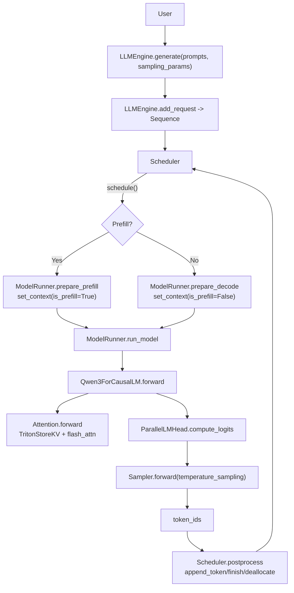

# nano-vllm 源码调研文档（精炼版）

## 1. nano-vllm 是什么？

**nano-vllm 是一个从零实现的轻量版 vLLM 推理引擎**：用更少、更可读的 Python 代码，复刻 vLLM 离线推理的关键路径（批调度、PagedAttention/KV cache 块管理、Prefix cache、Tensor Parallel、torch.compile、CUDA graph 等）。

- **定位**：离线批量推理（offline inference），追求吞吐与实现可读性；API 形态接近 vLLM。
- **依赖栈**：`torch`（含 `torch.compile`/CUDA graph）、`torch.distributed`（TP）、`flash-attn`（prefill/decode attention kernel）、`triton`（写 KV cache 的自定义 kernel）、`transformers`（读取 HF config/tokenizer）。
- **示例入口**：`example.py`（加载 tokenizer，构造 `LLM`，调用 `generate`）。

关键入口文件：

- `nanovllm/llm.py`：`LLM` 只是 `LLMEngine` 的别名。
- `nanovllm/engine/llm_engine.py`：对外推理循环（`generate`/`step`）。

## 2. nano-vllm 架构

### 2.1 分层视图

- **API 层**：`LLM(LLMEngine)`，负责接收 prompt/参数并驱动推理循环。
- **调度层**：`Scheduler` 维护 `waiting/running` 队列，决定本轮做 prefill 还是 decode，并在 decode 阶段做抢占（preempt）。
- **内存层（KV cache）**：`BlockManager` 管理固定大小 KV blocks 池，并给每条 `Sequence` 维护 `block_table`（逻辑页表）；支持按块 hash 的 prefix 复用。
- **执行层**：`ModelRunner` 负责 TP 初始化、多进程通信、模型加载、KV cache 预分配与绑定、prefill/decode 的输入组织、（可选）CUDA graph 捕获与 replay。
- **模型与算子层**：`models/qwen3.py` + `layers/*`（TP 线性/embedding、RoPE、RMSNorm、Attention、Sampler 等）。

### 2.2 关键调用链（从请求到 token）

### 2.3 Prefill 与 Decode 的差异（实现要点）

- **Prefill**：批内把每条序列“未缓存的 prompt token”拼接为 varlen 输入，构造 `cu_seqlens_q/cu_seqlens_k`，走 `flash_attn_varlen_func`。
- **Decode**：批内每条序列只输入 1 个 token（last token），走 `flash_attn_with_kvcache`；必要时启用 CUDA graph replay 降低 launch 开销。
- **统一点**：两阶段都通过 `utils/context.py` 写入 `Context`，由 `layers/attention.py` 与 `layers/embed_head.py` 在 forward 中读取。

## 3. 特点

nano-vllm 的核心特点与设计理念：

- **可读性优先**：核心推理路径集中在 `engine/*` 与 `layers/*`，代码量精简，便于学习 vLLM 的设计思路与实现细节。
- **吞吐导向**：采用 prefill varlen + decode 单 token + KV cache 块管理 +（可选）CUDA graph 等优化策略，追求离线批量推理的吞吐性能。
- **工程取舍明确**：功能集收敛（采样/停止条件/多模型支持等）换取实现简洁，聚焦核心推理路径，避免过度工程化。
- **轻量实现**：从零实现，依赖栈清晰（torch、flash-attn、triton、transformers），便于理解与二次开发。

## 4. 组件与组件实现（按关键路径）

### 4.1 `LLMEngine`：推理主循环与 TP 进程管理

对应文件：`nanovllm/engine/llm_engine.py`

- **配置聚合**：从 `kwargs` 中筛出 `Config` 字段，构造 `Config(model, ...)`。
- **TP 多进程**：当 `tensor_parallel_size > 1` 时，spawn 出 rank>0 的子进程；rank0 在主进程内持有 `ModelRunner`，并通过 Event 驱动其他 rank 执行同名方法。
- **生成循环**：`generate()` 内部反复 `step()`，直到 `Scheduler.is_finished()` 为 True。

### 4.2 `Scheduler`：两阶段调度 + 抢占（preempt）

对应文件：`nanovllm/engine/scheduler.py`

- **Prefill 调度目标**：在 `max_num_seqs` 与 `max_num_batched_tokens` 约束下尽量多塞序列；且必须 `BlockManager.can_allocate(seq)`。
- **Decode 调度目标**：尽量取 `running` 队列中的序列继续生成；若 `BlockManager.can_append(seq)` 不满足（KV block 不够），会抢占其他序列释放资源（`preempt()`）。
- **结束条件**：`postprocess()` 中遇到 EOS（且未 `ignore_eos`）或达到 `max_tokens`，则标记 FINISHED 并释放其 KV blocks。

### 4.3 `Sequence`：序列状态、块表与跨进程序列化优化

对应文件：`nanovllm/engine/sequence.py`

- 维护 token 序列、`block_table`、`num_cached_tokens`、采样温度与最大生成长度等。
- **硬耦合点**：`Sequence.block_size = 256`（与 `Config.kvcache_block_size` 的“256 倍数约束”共同决定块大小策略）。
- **跨进程优化**：`__getstate__` 在 decode 阶段只序列化 `last_token`（避免传输整个 token 列表）。

### 4.4 `BlockManager`：PagedAttention 风格的块管理 + Prefix Cache

对应文件：`nanovllm/engine/block_manager.py`

- **块池**：维护 `free_block_ids/used_block_ids`；每个 block 有 `ref_count` 用于共享。
- **Prefix cache**：对“满 block”的 token_ids 计算 xxhash（链式地把前缀 hash 纳入计算），维护 `hash_to_block_id`，命中时复用并增加引用计数。
- **追加策略**：decode 追加时，当新 token 进入下一个 block 的第 1 个位置时分配新 block；当某个 block 被填满时把其 hash 写回 `hash_to_block_id` 供后续复用。

### 4.5 `ModelRunner`：TP 初始化、模型加载、KV cache 预分配、输入组织、CUDA graph

对应文件：`nanovllm/engine/model_runner.py`

- **TP 初始化**：`dist.init_process_group("nccl", "tcp://localhost:2333", ...)`，并 `torch.cuda.set_device(rank)`。
- **模型加载**：构造 `Qwen3ForCausalLM(hf_config)`，再用 `utils/loader.py` 从 `*.safetensors` 加载权重；支持 packed modules mapping（QKV/MLP 的合并参数拆装）。
- **KV cache 预分配与绑定**：
  - 估算每个 block 的字节数，按 `gpu_memory_utilization` 计算可分配 `num_kvcache_blocks`；
  - 分配全局 `kv_cache` 大张量；
  - 遍历模块，把每层 `Attention.k_cache/v_cache` 指向各自切片（按 layer_id 绑定）。
- **输入组织**：
  - `prepare_prefill()`：拼接未缓存 tokens，构建 `cu_seqlens_q/cu_seqlens_k`、`slot_mapping`；若存在 prefix cache，则构建 `block_tables`。
  - `prepare_decode()`：每序列 1 token，构造 `context_lens`、`slot_mapping` 与 `block_tables`。
- **CUDA graph**：
  - `enforce_eager=False` 时捕获不同 batch size 的 decode 图（prefill 不走图）；
  - decode 阶段满足条件时 `graph.replay()`。
- **多进程通信**：TP>1 时 rank0 通过 1MiB 共享内存 + Event 向 rank>0 广播方法与参数（pickle）。

### 4.6 `Attention`：Triton 写 KV + flash-attn 两条路径

对应文件：`nanovllm/layers/attention.py`

- **写 KV**：用 Triton kernel `store_kvcache_kernel` 按 `slot_mapping` 把 K/V 写入页式 KV cache。
- **Prefill**：`flash_attn_varlen_func(..., block_table=...)`，支持 varlen 与（可选）prefix cache 的 block_table。
- **Decode**：`flash_attn_with_kvcache(..., cache_seqlens=context_lens, block_table=...)`。

### 4.7 TP 线性/Embedding/LMHead：最小可用的张量并行组件

对应文件：`nanovllm/layers/linear.py`、`nanovllm/layers/embed_head.py`

- **RowParallelLinear**：forward 后 `dist.all_reduce` 聚合。
- **VocabParallelEmbedding/ParallelLMHead**：词表分片；LMHead 在 prefill 阶段只对每条序列“最后一个 token”的 hidden state 计算 logits，减少无效计算；TP>1 时 rank0 gather 拼回全词表 logits。

### 4.8 采样：仅温度采样（且禁止 greedy）

对应文件：`nanovllm/sampling_params.py`、`nanovllm/layers/sampler.py`

- `SamplingParams` 仅包含 `temperature/max_tokens/ignore_eos`，并断言 `temperature > 1e-10`（不允许 greedy）。
- `Sampler` 走温度缩放 + softmax 后的采样（实现上采用指数噪声 trick），并用 `torch.compile` 加速。

## 5. 已知限制与注意事项（精炼清单）

- **模型支持**：当前仓库内置模型实现仅见 `nanovllm/models/qwen3.py`（其他架构需自行扩展）。
- **采样能力有限**：无 top-k/top-p/penalty/stop sequences 等常见策略；且不支持 greedy（`temperature=0`）。
- **TP 初始化写死**：`tcp://localhost:2333` 固定，跨机器/多实例并发时需要改造。
- **共享内存固定 1MiB**：大批量/大对象参数广播可能触顶（当前主要广播 `Sequence` 状态与少量张量元信息）。
- **块大小耦合**：`Config.kvcache_block_size` 只约束为 256 的倍数，但 `Sequence.block_size` 固定 256；若要改块大小需同步调整。

## 6. 关键源码索引（从问题到位置）

| 你想看什么                    | 位置（文件 / 关键函数）                                                     |
| ----------------------------- | --------------------------------------------------------------------------- |
| 顶层 API 与推理循环           | `nanovllm/engine/llm_engine.py` / `generate`, `step`                        |
| prefill vs decode 调度与抢占  | `nanovllm/engine/scheduler.py` / `schedule`, `preempt`, `postprocess`       |
| KV cache 块管理与 prefix 复用 | `nanovllm/engine/block_manager.py` / `allocate`, `may_append`, `deallocate` |
| KV cache 预分配与层绑定       | `nanovllm/engine/model_runner.py` / `allocate_kv_cache`                     |
| prefill 输入组织与 Context    | `nanovllm/engine/model_runner.py` / `prepare_prefill`                       |
| decode 输入组织与 Context     | `nanovllm/engine/model_runner.py` / `prepare_decode`                        |
| 写 KV + flash-attn 调用       | `nanovllm/layers/attention.py` / `store_kvcache`, `Attention.forward`       |
| TP 线性层实现                 | `nanovllm/layers/linear.py` / `ColumnParallelLinear`, `RowParallelLinear`   |
| TP vocab embedding / LMHead   | `nanovllm/layers/embed_head.py`                                             |
| 权重加载（safetensors）       | `nanovllm/utils/loader.py` / `load_model`                                   |
