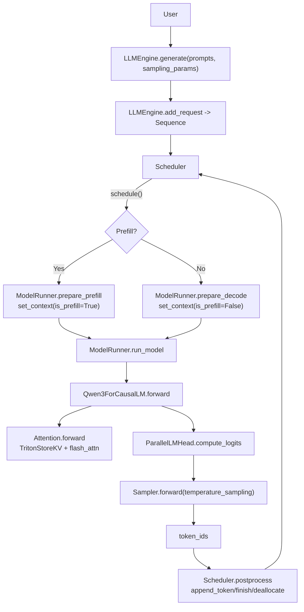
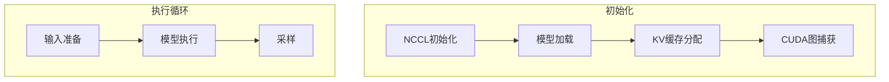

# nano-vllm 源码调研文档（精炼版）

## 1. nano-vllm 是什么？

**nano-vllm 是一个从零实现的轻量版 vLLM 推理引擎**：用更少、更可读的 Python 代码，复刻 vLLM 离线推理的关键路径（批调度、PagedAttention/KV cache 块管理、Prefix cache、Tensor Parallel、torch.compile、CUDA graph 等）。

- **定位**：离线批量推理（offline inference），追求吞吐与实现可读性；API 形态接近 vLLM。
- **依赖栈**：`torch`（含 `torch.compile`/CUDA graph）、`torch.distributed`（TP）、`flash-attn`（prefill/decode attention kernel）、`triton`（写 KV cache 的自定义 kernel）、`transformers`（读取 HF config/tokenizer）。
- **示例入口**：`example.py`（加载 tokenizer，构造 `LLM`，调用 `generate`）。

关键入口文件：

- `nanovllm/llm.py`：`LLM` 只是 `LLMEngine` 的别名。
- `nanovllm/engine/llm_engine.py`：对外推理循环（`generate`/`step`）。

## 2. nano-vllm 架构

### 2.1 分层视图

- **API 层**：`LLM(LLMEngine)`，负责接收 prompt/参数并驱动推理循环。
- **调度层**：`Scheduler` 维护 `waiting/running` 队列，决定本轮做 prefill 还是 decode，并在 decode 阶段做抢占（preempt）。
- **内存层（KV cache）**：`BlockManager` 管理固定大小 KV blocks 池，并给每条 `Sequence` 维护 `block_table`（逻辑页表）；支持按块 hash 的 prefix 复用。
- **执行层**：`ModelRunner` 负责 TP 初始化、多进程通信、模型加载、KV cache 预分配与绑定、prefill/decode 的输入组织、（可选）CUDA graph 捕获与 replay。
- **模型与算子层**：`models/qwen3.py` + `layers/*`（TP 线性/embedding、RoPE、RMSNorm、Attention、Sampler 等）。

### 2.2 关键调用链（从请求到 token）

## 3. 组件

### 3.1 Scheduler

#### 3.1.1 简介

Scheduler 负责：
- 维护 waiting/running 两个队列，管理序列的生命周期
- prefill 阶段：从 waiting 队列选择序列，分配 KV cache blocks，加入 running
- decode 阶段：从 running 队列选择序列继续生成；资源不足时抢占其他序列
- 后处理：检查停止条件（EOS/max_tokens），释放已完成的序列资源

#### 3.1.2 功能

- **队列管理**：waiting（等待资源）与 running（正在处理）队列（[scheduler.py](../nanovllm/engine/scheduler.py#L27-L31)）。
- **调度逻辑**：`schedule()` 先尝试 prefill，满足 max_num_seqs、max_num_batched_tokens 与 BlockManager.can_allocate 约束；若无 prefill，则调度 decode，必要时调用 preempt() 释放资源（[scheduler.py](../nanovllm/engine/scheduler.py#L41-L126)）。
- **抢占与恢复**：`preempt()` 将序列状态置回 WAITING、释放其 KV 块并放回 waiting 队首（[scheduler.py](../nanovllm/engine/scheduler.py#L128-L140)）。
- **后处理**：`postprocess()` 追加新 token，检查 EOS 或 max_tokens 以标记完成并释放块（[scheduler.py](../nanovllm/engine/scheduler.py#L142-L166)）。

#### 3.1.3 关键属性

`waiting: deque[Sequence]`：等待队列；
- 尚未分配 KV cache blocks 的请求，新请求由 `add(seq)` 加入队尾。
- prefill 阶段 `schedule()` 从队头取、分配块后移入 running。
- 当 decode 资源不足触发抢占时，被抢占的序列会放回 waiting 队首以加速下一轮调度（FIFO）。

`running: deque[Sequence]`：运行队列；
- 已分配块、正在 prefill 或 decode 的序列
- 在 decode 阶段按 FIFO 从队头取，确保公平继续生成；
- 若块不足则从队尾抢占以腾出 KV 块

### 3.2 BlockManager

#### 3.2.1 简介

**BlockManager** 是 nano-vllm 中的核心内存管理组件，负责实现**分页式 KV 缓存系统**，支持前缀缓存和引用计数共享机制。

#### 3.2.2 功能

- PagedAttention 风格的块管理：固定大小的 blocks 池，按需分配
- Prefix cache：通过 hash 匹配实现相同 token 前缀的 KV cache 复用
- 引用计数：支持多个序列共享同一个 block（prefix cache 场景）

#### 3.2.3 关键属性

- `blocks: list[Block]`：存储块对象列表, 每个 Block 包含物理块 ID、引用计数、哈希值和 token_ids
- `hash_to_block_id: dict[int, int]`: 哈希到块 ID 的映射,实现基于内容的块查找和共享

### 3.3 ModelRunner

#### 3.3.1 简介

ModelRunner 是 nano-vllm 的分布式模型执行引擎，负责模型加载、KV 缓存管理、输入准备与前向执行，支持多 GPU 张量并行与 CUDA Graph 优化（见 [model_runner.py](../nanovllm/engine/model_runner.py#L26)）。它接收 Scheduler 给出的 `seqs + is_prefill`，在 GPU 上完成一次 prefill 或 decode，并在 rank0 采样得到新 token。

#### 3.3.2 核心职责

- **分布式执行协调**：初始化 NCCL 进程组，支持主进程（rank0）-工作进程架构，通过 SharedMemory 下发方法调用并在子进程循环执行（[model_runner.py](../nanovllm/engine/model_runner.py)）。
- **内存管理（KV cache）**：按显存利用率估算可分配的 KV block 数并一次性分配大 KV 张量，将每层 Attention 的 `k_cache/v_cache` 指向对应切片（[model_runner.py](../nanovllm/engine/model_runner.py)）。
- **输入数据准备**：
  - **Prefill**：构建展平的 `input_ids/positions`，计算 `cu_seqlens_q/k`、`slot_mapping`，必要时构造 `block_tables` 以支持 prefix cache（[model_runner.py](../nanovllm/engine/model_runner.py)）。
  - **Decode**：仅准备每条序列的最后一个 token 输入，计算 `context_lens` 与写入 slot，构造 `block_tables`（[model_runner.py](../nanovllm/engine/model_runner.py)）。
- **模型执行优化**：根据阶段与 batch size 选择 eager 或 CUDA Graph；decode 阶段可重放预捕获的 graph 以降低 Python/kernel 启动开销（[model_runner.py](../nanovllm/engine/model_runner.py)）。预捕获逻辑见 `capture_cudagraph()`（[model_runner.py](../nanovllm/engine/model_runner.py)）。

#### 3.3.3 执行流程（概览）

#### 3.3.4 与其他组件协作

- **与 Scheduler**：接收调度后的 `seqs` 与 `is_prefill`，执行一次推理步并返回本步生成 token（通过 `run()` 路径）。
- **与 LLMEngine**：LLMEngine 通过 `call(\"run\", seqs, is_prefill)` 驱动 ModelRunner；多卡时 rank0 通过 SharedMemory 广播调用，子进程执行同样的前向（见 `call()/write_shm()/read_shm()`）。
- **与 Attention 层**：通过 Context 传递 `slot_mapping` 与 `block_tables`，用于写 KV cache 与 flash-attn 的 paged/block_table 访问（`set_context/reset_context` + attention 读取）。

#### 3.3.5 Notes

- **分布式支持**：完整张量并行（TP）路径，多 GPU 可扩展。
- **内存优化**：按可用显存动态决定 KV blocks 数量，最大化利用率。
- **计算优化**：CUDA Graph 对 decode 更友好，可显著降低重放开销。 

## 4. 特点

### 4.1 Prefix Caching

特点：通过 hash 匹配实现相同 token 前缀的 KV cache 复用。

### 4.2 Continuous Batching

特点：
1. 循环执行 step。每个 step 可进行 prefll/decode 计算：
1.1 针对 decode，所有请求只生成一个 token。
1.2 针对 prefill 阶段，完成 prefill。
2. Prefill 优先：先处理 waiting 队列中的新请求
3. Decode 补充：无 prefill 时处理 running 队列的续生请求

综上，达到效果：
1. 新请求不会被 prefill 饥饿。
2. 完成 prefill 后的请求会立刻被加入到 decode 批处理中。

### 4.2 CUDA Graph

1. 为不同批次大小（1, 2, 4, 8, 16, 32, ..., 512）预先捕获 CUDA 图 ([model_runner.py](../nanovllm/engine/model_runner.py) line228-229)
2. 使用反向顺序捕获以复用内存池 ([model_runner.py](../nanovllm/engine/model_runner.py) line500)
3. 在 run_model() 中，根据批次大小选择合适的图并 replay：
    - 查找不小于当前批次大小的最小预捕获图
    - 更新输入张量数据
    - 调用 graph.replay() 执行计算
